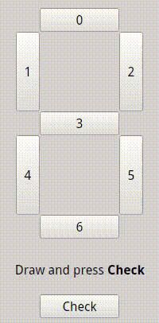

# PyQt-BPNN

A PyQt GUI app that uses Back-Propagation Neural Networks to train and match user defined patterns.

Basically the app tests 10 `7 segment display` pattern with their actual values like the following. A 7 segment display looks like the following.

```
---0---
|     |
1     2
|     |
---3---
|     |
4     5
|     |
---6---
```

A 7bit-input vs 4bit-output map would look like this.

```python
[
# 0  1  2  3  4  5  6
[[1, 1, 1, 0, 1, 1, 1], [0, 0, 0, 0]], # 0
[[0, 0, 1, 0, 0, 1, 0], [0, 0, 0, 1]], # 1
[[1, 0, 1, 1, 1, 0, 1], [0, 0, 1, 0]], # 2
[[1, 0, 1, 1, 0, 1, 1], [0, 0, 1, 1]], # 3
[[0, 1, 1, 1, 0, 1, 0], [0, 1, 0, 0]], # 4
[[1, 1, 0, 1, 0, 1, 1], [0, 1, 0, 1]], # 5
[[1, 1, 0, 1, 1, 1, 1], [0, 1, 1, 0]], # 6
[[1, 1, 1, 0, 0, 1, 0], [0, 1, 1, 1]], # 7
[[1, 1, 1, 1, 1, 1, 1], [1, 0, 0, 0]], # 8
[[1, 1, 1, 1, 0, 1, 1], [1, 0, 0, 1]]  # 9
]
```

The program trains a Neural Network with 7bit input, 7bit hidden and 4bit output nodes. Then the user can click and draw any number. On clicking `Check`, the user provided segment values will be tested and a predicted value from the network will be shown.

# How to Run

To run, execute `python3 Widget.py`.

Then all the input patterns will be trained.

```
Creating Neural Network...
Training patterns...
error 10.45545 iterations 0
error 3.79253 iterations 1000
error 2.73814 iterations 2000
error 3.66140 iterations 3000
.............................
Training complete!
```

And finally the user can test any custom pattern and get predicted results.



# Back-Propagation Neural Networks

Written by Neil Schemenauer `<nas@arctrix.com>`